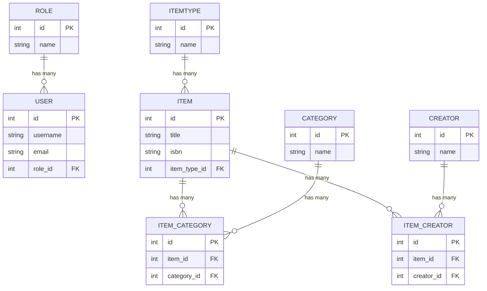

place header here

# Entity Relationship Diagram and Python Buildout (example only and incomplete)


## Below is the canonical ERD for the library system you and I have been refining.
It includes:
- One‑to‑Many (Role → User, ItemType → Item)
- Many‑to‑Many (Item ↔ Category, Item ↔ Creator)
- Association tables
- Attributes that match real SQLAlchemy models

## Master ERD - suggestion



models.py
```python
class Role(db.Model):
    id = db.Column(db.Integer, primary_key=True)
    name = db.Column(db.String, nullable=False)

    users = db.relationship("User", back_populates="role")


class User(db.Model):
    id = db.Column(db.Integer, primary_key=True)
    username = db.Column(db.String, nullable=False)
    email = db.Column(db.String, nullable=False)

    role_id = db.Column(db.Integer, db.ForeignKey("role.id"))
    role = db.relationship("Role", back_populates="users")

```

## 2. ItemType ↔ Item (One‑to‑Many)
### ERD insight
- One ItemType has many Items
- FK lives on item.item_type_id
```
models.py mapping
```
```python
class ItemType(db.Model):
    id = db.Column(db.Integer, primary_key=True)
    name = db.Column(db.String, nullable=False)

    items = db.relationship("Item", back_populates="item_type")


class Item(db.Model):
    id = db.Column(db.Integer, primary_key=True)
    title = db.Column(db.String, nullable=False)
    isbn = db.Column(db.String)

    item_type_id = db.Column(db.Integer, db.ForeignKey("item_type.id"))
    item_type = db.relationship("ItemType", back_populates="items")
```

## 3. Item ↔ Category (Many‑to‑Many)
## ERD insight
- Many‑to‑many is implemented using a join table
- Students must see that this is *two* one‑to‑many relationships

