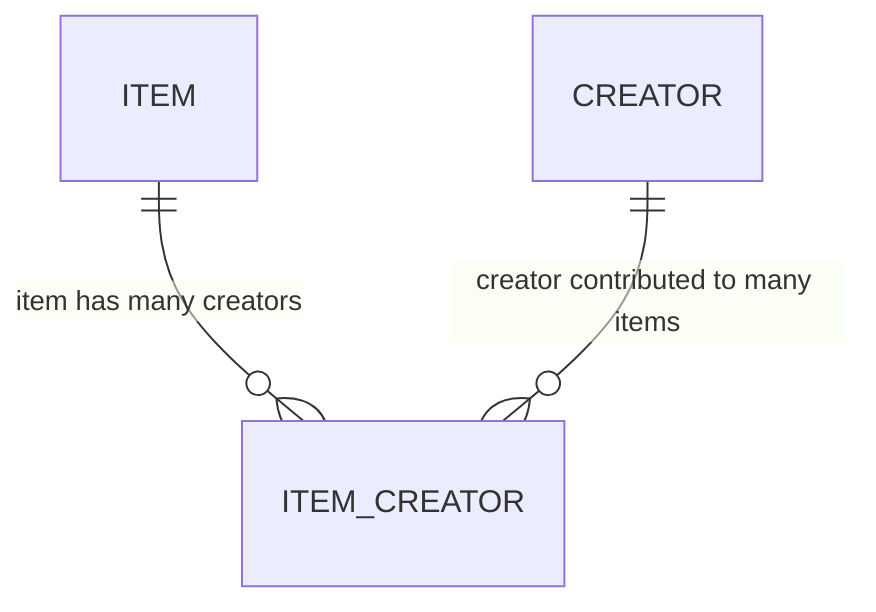
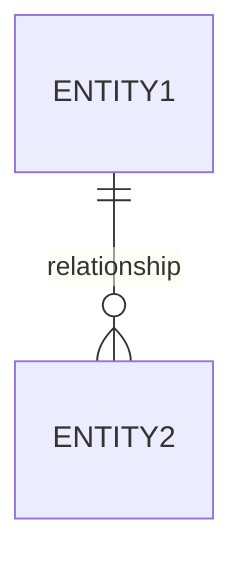

# ERD Drawing Exercise

*A structured, syllabus‑aligned ERD drawing activity for SE12 students*

This exercise helps you practise designing **Entity‑Relationship Diagrams (ERDs)** using the same modelling techniques used in the Online Library Catalogue project.

You will analyse requirements, identify entities, determine relationships, and draw ERDs using **Mermaid**, the same tool used throughout this documentation.

## Learning Outcomes
By completing this exercise, you will be able to:
- identify entities, attributes, and primary keys
- distinguish between one‑to‑many and many‑to‑many relationships
- design and justify join tables
- translate a scenario into a relational model
- draw ERDs using Mermaid syntax
- explain how your ERD supports data integrity and normalisation

These outcomes align with the NSW Software Engineering Stage 6 syllabus focus on **data modelling, database design, and relational thinking**.


## Part 1 — Warm‑Up: Identify Entities and Relationships
Read the scenario:

A school library wants to track which students borrow which books.
Each student can borrow many books.
Each book can be borrowed many times, but only by one student at a time.
The library also wants to record the date a book was borrowed and returned.

### Task 1: Identify the entities
List the nouns that represent data objects.
- Student
- Book
- Loan (you should recognise this as a join table)

### Task 2: Identify the relationships
- One Student → many Loans
- One Book → many Loans

This is a **many‑to‑many** relationship resolved through a join table.


## Part 2 — Draw the ERD (Starter Code Provided)
```mermaid
erDiagram
erDiagram
    STUDENT ||--o{ LOAN : "borrows"
    BOOK ||--o{ LOAN : "is borrowed in"

    STUDENT {
        int id PK
        string name
        string year_group
    }

    BOOK {
        int id PK
        string title
        string author
    }

    LOAN {
        int id PK
        int student_id FK
        int book_id FK
        date borrowed_on
        date returned_on
    }
```

### Task 3: Add at least two more attributes to each entity
Examples:
- Student: email, library_card_number
- Book: isbn, category
- Loan: due_date, condition_on_return


## Part 3 — Apply the Model to the Online Library Catalogue
Now connect this exercise to the real project.

### Task 4: Compare your ERD to the project’s ITEM–CREATOR relationship
Here is the project’s many‑to‑many structure:

#### Answer the following:

1. What role does ITEM_CREATOR play in the relationship?
2. Why can’t we store multiple creators inside the ITEM table?
3. How does this design support normalisation?

## Part 4 — Design Your Own ERD (Open‑Ended Challenge)
Choose one of the following scenarios and design a complete ERD:

#### Scenario A — Clubs and Memberships
Students can join many clubs
Clubs have many students
Clubs have events
Events are run by a teacher

#### Scenario B — Online Courses
Courses have modules
Students enrol in many courses
Each module has multiple resources
Students complete quizzes for each module

#### Scenario C — Creative Works
Creators produce works
Works belong to categories
Works can have multiple contributors
Contributors can work on multiple works

### Task 5: Draw your ERD using Mermaid
Use this template:

*Add:*
- entities
- attributes
- primary keys
- foreign keys
- join tables where needed


## Extension Task — Integrate Your ERD Into the Project
For advanced students:

- Add your ERD to the docs/architecture/ folder
- Write a short explanation of how your design supports:
-- normalisation
-- data integrity
-- scalability
-- future features

This mirrors real‑world documentation practice.


### Submission Checklist

- [ ] Identified entities and attributes
- [ ] Correctly modelled one‑to‑many and many‑to‑many relationships
- [ ] Drawn at least one Mermaid ERD
- [ ] Explained your design choices
- [ ] Connected your work to the Online Library Catalogue project
