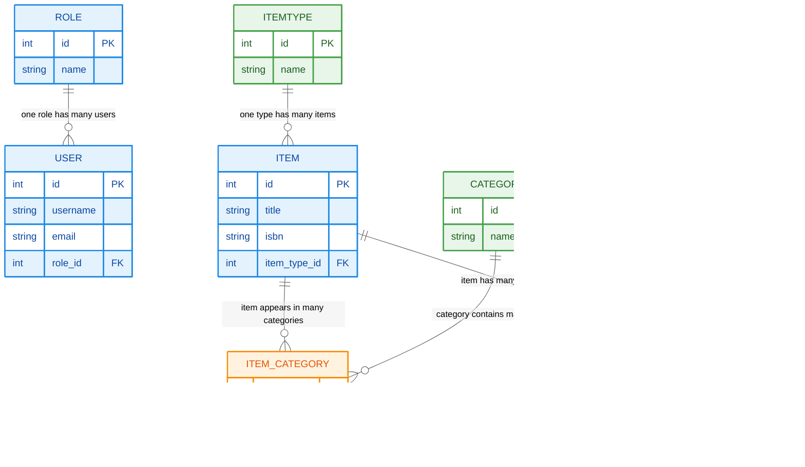

# Master ERD — Online Library Catalogue

```mermaid
%%{init: {
  "theme": "neutral",
  "flowchart": { "curve": "basis" }
}}%%

erDiagram

    ROLE ||--o{ USER : "one role has many users"
    ITEMTYPE ||--o{ ITEM : "one type has many items"

    ITEM ||--o{ ITEM_CATEGORY : "item appears in many categories"
    CATEGORY ||--o{ ITEM_CATEGORY : "category contains many items"

    ITEM ||--o{ ITEM_CREATOR : "item has many creators"
    CREATOR ||--o{ ITEM_CREATOR : "creator contributed to many items"

    ROLE {
        int id PK
        string name
    }

    USER {
        int id PK
        string username
        string email
        int role_id FK
    }

    ITEMTYPE {
        int id PK
        string name
    }

    ITEM {
        int id PK
        string title
        string isbn
        int item_type_id FK
    }

    CATEGORY {
        int id PK
        string name
    }

    CREATOR {
        int id PK
        string name
    }

    ITEM_CATEGORY {
        int id PK
        int item_id FK
        int category_id FK
    }

    ITEM_CREATOR {
        int id PK
        int item_id FK
        int creator_id FK
    }

    classDef core   fill:#e3f2fd,stroke:#1e88e5,stroke-width:2px,color:#0d47a1;
    classDef lookup fill:#e8f5e9,stroke:#43a047,stroke-width:2px,color:#1b5e20;
    classDef join   fill:#fff3e0,stroke:#fb8c00,stroke-width:2px,color:#e65100;

    class ROLE          core
    class USER          core
    class ITEM          core

    class ITEMTYPE      lookup
    class CATEGORY      lookup
    class CREATOR       lookup

    class ITEM_CATEGORY join
    class ITEM_CREATOR  join
```
