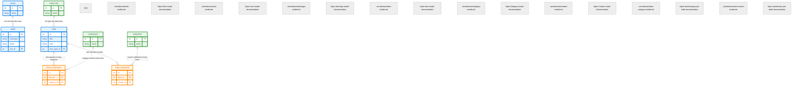

# Master Entity‑Relationship Diagram  
A complete, interactive ERD showing the relational structure of the Online Library Catalogue.

```mermaid
%%{init: {
  "theme": "neutral",
  "flowchart": { "curve": "basis" }
}}%%

erDiagram

    %% ======================================================
    %% RELATIONSHIPS (with tooltips)
    %% ======================================================

    %% One Role → Many Users
    ROLE ||--o{ USER : "one role has many users"
    %% "Each user belongs to exactly one role."

    %% One ItemType → Many Items
    ITEMTYPE ||--o{ ITEM : "one type has many items"
    %% "The foreign key lives on the ITEM table."

    %% Many Items ↔ Many Categories (via join table)
    ITEM ||--o{ ITEM_CATEGORY : "item appears in many categories"
    CATEGORY ||--o{ ITEM_CATEGORY : "category contains many items"
    %% "This is a true many‑to‑many implemented using a join table."

    %% Many Items ↔ Many Creators (via join table)
    ITEM ||--o{ ITEM_CREATOR : "item has many creators"
    CREATOR ||--o{ ITEM_CREATOR : "creator contributed to many items"
    %% "Another many‑to‑many relationship implemented via a join table."

    %% ======================================================
    %% ENTITIES (with clickable links)
    %% ======================================================

    ROLE {
        int id PK
        string name
    }
    click ROLE "../architecture/role-model.md" "Open Role model documentation"

    USER {
        int id PK
        string username
        string email
        int role_id FK
    }
    click USER "../architecture/user-model.md" "Open User model documentation"

    ITEMTYPE {
        int id PK
        string name
    }
    click ITEMTYPE "../architecture/itemtype-model.md" "Open ItemType model documentation"

    ITEM {
        int id PK
        string title
        string isbn
        int item_type_id FK
    }
    click ITEM "../architecture/item-model.md" "Open Item model documentation"

    CATEGORY {
        int id PK
        string name
    }
    click CATEGORY "../architecture/category-model.md" "Open Category model documentation"

    CREATOR {
        int id PK
        string name
    }
    click CREATOR "../architecture/creator-model.md" "Open Creator model documentation"

    ITEM_CATEGORY {
        int id PK
        int item_id FK
        int category_id FK
    }
    click ITEM_CATEGORY "../architecture/item-category-model.md" "Open ItemCategory join table documentation"

    ITEM_CREATOR {
        int id PK
        int item_id FK
        int creator_id FK
    }
    click ITEM_CREATOR "../architecture/item-creator-model.md" "Open ItemCreator join table documentation"

    %% ======================================================
    %% CLASS DEFINITIONS (colour coding)
    %% ======================================================

    classDef core   fill:#e3f2fd,stroke:#1e88e5,stroke-width:2px,color:#0d47a1;
    classDef lookup fill:#e8f5e9,stroke:#43a047,stroke-width:2px,color:#1b5e20;
    classDef join   fill:#fff3e0,stroke:#fb8c00,stroke-width:2px,color:#e65100;

    class ROLE          core
    class USER          core
    class ITEM          core

    class ITEMTYPE      lookup
    class CATEGORY      lookup
    class CREATOR       lookup

    class ITEM_CATEGORY join
    class ITEM_CREATOR  join
```
