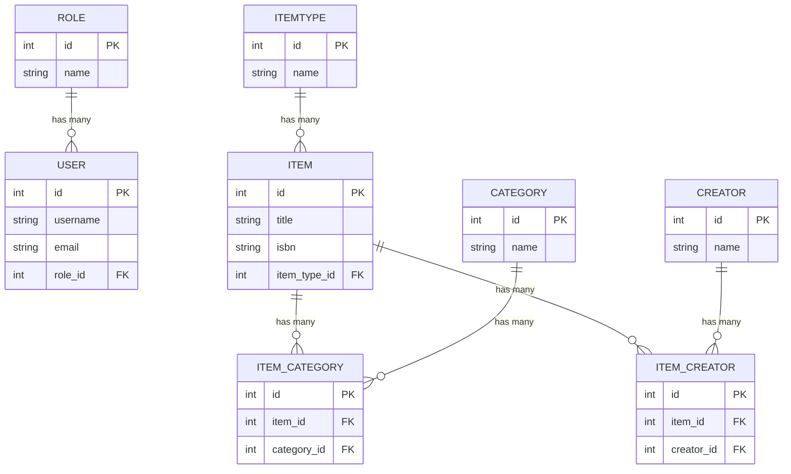

```mermaid
erDiagram

    ROLE ||--o{ USER : "has many"
    ITEMTYPE ||--o{ ITEM : "has many"

    ITEM ||--o{ ITEM_CATEGORY : "has many"
    CATEGORY ||--o{ ITEM_CATEGORY : "has many"

    ITEM ||--o{ ITEM_CREATOR : "has many"
    CREATOR ||--o{ ITEM_CREATOR : "has many"

    ROLE {
        int id PK
        string name
    }

    USER {
        int id PK
        string username
        string email
        int role_id FK
    }

    ITEMTYPE {
        int id PK
        string name
    }

    ITEM {
        int id PK
        string title
        string isbn
        int item_type_id FK
    }

    CATEGORY {
        int id PK
        string name
    }

    CREATOR {
        int id PK
        string name
    }

    ITEM_CATEGORY {
        int id PK
        int item_id FK
        int category_id FK
    }

    ITEM_CREATOR {
        int id PK
        int item_id FK
        int creator_id FK
    }
```
