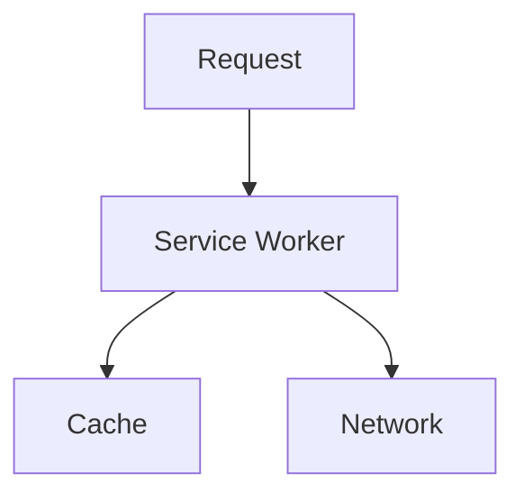
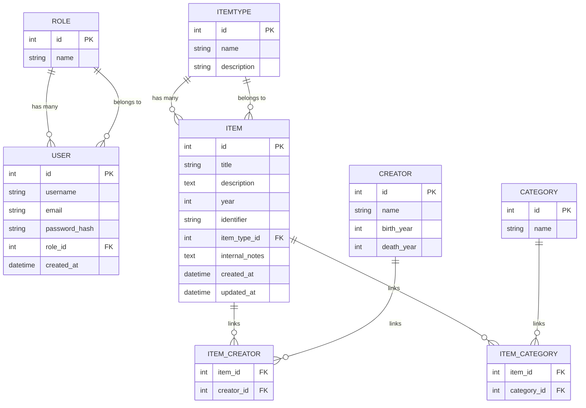
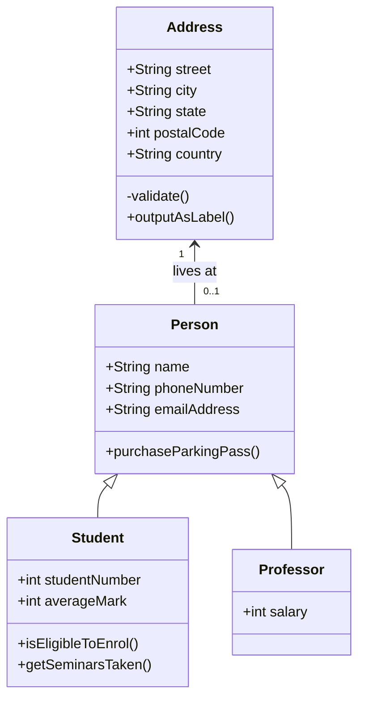

# Documentation Style Guide  
### Stage 6 Software Engineering — Sydney Technical High School

This style guide defines how you should write technical documentation for the Software Engineering course.  
Clear, consistent documentation is a core professional skill and is assessed throughout the project.

---

## 1. Purpose of Documentation

Your documentation must:

- Explain your system clearly and accurately  
- Support maintainability and future development  
- Demonstrate your understanding of software engineering principles  
- Provide evidence of your design and decision‑making  

Write for a technical audience: senior students, teachers, and developers.

---

## 2. Structure and Organisation

Each page should follow this structure:

1. **Title**  
2. **Purpose / Overview**  
3. **Technical Detail**  
4. **Examples or Diagrams**  
5. **Notes, Limitations, or Assumptions**  
6. **References (if needed)**  

Use headings (`##`, `###`) to break up content logically.

---

## 3. Writing Style

### 3.1 Clarity
- Use short, direct sentences.  
- Avoid unnecessary jargon.  
- Define technical terms when first introduced.

### 3.2 Precision
- Be specific about behaviour, inputs, outputs, and constraints.  
- Avoid vague phrases like “it works” or “it does stuff”.

### 3.3 Professional Tone
- No slang.  
- No conversational filler.  
- No first‑person unless describing your design decisions.

Example:

> “The service worker implements a cache‑first strategy for static assets to reduce load times.”

---

## 4. Markdown Conventions

### 4.1 Code Blocks
Use fenced code blocks with language labels:

````markdown
```python
def example():
    return "hello"
```
````

will look like this with colour coding for your Python...

```python
def example():
    return "hello"
```


### 4.2 Diagrams
Use Mermaid for diagrams:
#### Flowcharts

````markdown

````

will render into this!


#### Entity Relationship Diagrams: to show a database schema with entities/tables and relationships

This uses markdown mermaid to create a diagram of your database schema.
This diagram shows how the main tables in your project relate to each other.  
It uses **Mermaid ERD syntax**, which GitHub renders automatically.
*A visual overview of the relational model used in this template*

````markdown

````

to render as this...


#### Class Diagrams: to objected oriented design, data dictionaries, entities, attributes and attribute types

````markdown

````

renders beautifully as this ...


## 4.3 Admonitions
Use admonitions for emphasis:

````markdown
!!! note "Note"

    This endpoint requires authentication.
````


will look like:

```
!!! note "Note"

    This endpoint requires authentication.
```

